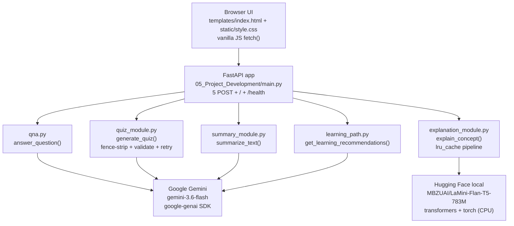

# EduGenie — AI-Powered Learning Assistant

> An AI-powered learning assistant with a FastAPI backend and a single-page HTML/CSS/JS frontend: Q&A, concept explanations, quiz generation, summarization, and learning-path recommendations.

EduGenie is a FastAPI application (`05_Project_Development/main.py`) that exposes 5 POST endpoints backed by modular Python services. Four modules call Google Gemini (`gemini-3.6-flash` via the official `google-genai` SDK); the Explain module runs fully local on the LaMini-Flan-T5-783M model (CPU-only, offline after the first download). A vanilla-JS single-page UI (`templates/index.html` + `static/style.css`) maps a task dropdown to the correct endpoint via `fetch()`. The repo uses an 8-phase academic folder layout (`01_...`–`08_...`); all runnable code lives in `05_Project_Development/`.

## Features

- **Q&A** (`05_Project_Development/qna.py` → `answer_question`) — answers general questions clearly and accurately via Gemini.
- **Explain** (`05_Project_Development/explanation_module.py` → `explain_concept`) — simplifies complex concepts with short sentences and an everyday example, using a local `MBZUAI/LaMini-Flan-T5-783M` text2text pipeline cached with `lru_cache` (loaded once, not per request).
- **Quiz** (`05_Project_Development/quiz_module.py` → `generate_quiz`) — generates exactly 3 MCQs with 4 options each from a passage (minimum 30 chars), returned as validated strict JSON where `answer` exactly matches one option string; strips ` ```json ` fences and retries once on parse failure.
- **Summary** (`05_Project_Development/summary_module.py` → `summarize_text`) — summarizes long passages concisely in 3–6 sentences (or a short bulleted list) via Gemini.
- **Learning Path** (`05_Project_Development/learning_path.py` → `get_learning_recommendations`) — generates a structured beginner → intermediate → advanced plan with videos/articles/books per stage plus practice projects, via Gemini.
- **Single-page UI** — task dropdown (Q&A / Explain / Quiz / Summary / Recommend), textarea input, loading/error states, HTML-escaped rendering with a dedicated quiz renderer.
- **Robust validation & errors** — Pydantic non-blank validators (HTTP 422), `ValueError` → HTTP 400, `RuntimeError` (missing key / empty model response / API failure) → HTTP 502; never 500 on bad user input.

## Tech Stack

- FastAPI `0.116.1` + Uvicorn `0.35.0` — REST API, Jinja2 templates, static files
- `google-genai` SDK `1.32.0`, model `gemini-3.6-flash` — Q&A, Quiz, Summary, Learning Path
- `MBZUAI/LaMini-Flan-T5-783M` via `transformers` `4.55.0` + `torch` `>=2.9.0,<2.15.0` + `sentencepiece` `0.2.1` — local Explain module (CPU-only)
- Jinja2 `3.1.6` + vanilla JS `fetch()` — single-page frontend
- `python-dotenv` `1.1.1` — `GEMINI_API_KEY` loaded from environment/`.env`; `python-multipart` `0.0.20`; CORS open for local use

## Architecture

5 service modules + FastAPI app + browser UI (7 interacting components, so an architecture diagram is warranted):



Request flow: UI dropdown selects task → `TASK_CONFIG` maps task to endpoint + request field + response key → `POST` JSON → Pydantic non-blank check → module function → Gemini or local model → JSON response rendered below the form.

## API Endpoints

Defined in `05_Project_Development/main.py`:

| Method | Path                     | Request body | Response key | Purpose                                              |
| ------ | ------------------------ | ------------ | ------------ | ---------------------------------------------------- |
| POST   | `/qa`                    | `{"question"}` | `answer` | Answer a question via Gemini                         |
| POST   | `/explain`               | `{"concept"}`  | `explanation` | Simplify a concept via local LaMini model         |
| POST   | `/quiz`                  | `{"passage"}`  | `quiz` | 3 MCQs from a passage (≥30 chars), strict JSON       |
| POST   | `/summarize`             | `{"text"}`     | `summary` | Summarize text via Gemini                            |
| POST   | `/learn/recommendations` | `{"topic"}`    | `learning_path` | Beginner → advanced plan via Gemini             |
| GET    | `/`                      | — | HTML | Serves `templates/index.html` via Jinja2Templates       |
| GET    | `/health`                | — | `{"status": "ok"}` | Health check                                   |

Example (Q&A):

```bash
curl -X POST http://127.0.0.1:8000/qa -H "Content-Type: application/json" -d "{\"question\": \"What is photosynthesis?\"}"
```

Error mapping (all POST endpoints): empty/whitespace input → `422`; `ValueError` from module logic (e.g. quiz passage < 30 chars) → `400`; missing `GEMINI_API_KEY` / empty model response / API failure → `502`.

## Environment Variables

From `05_Project_Development/.env.example` (names only — never commit real values):

| Key | Required for | Notes |
| --- | ------------ | ----- |
| `GEMINI_API_KEY` | Q&A, Quiz, Summary, Learning Path | Get one at https://aistudio.google.com/app/apikey; loaded via `load_dotenv()`; Explain module does not need it (fully local) |

`.env` is git-ignored. Only `.env.example` (placeholder) is tracked.

## Installation

All runnable code is in `05_Project_Development/`, so install and run from there. Detected package manager: `pip` + `venv` (`requirements.txt`, no `poetry.lock` / `package.json` / `pom.xml`).

Windows (PowerShell):

```powershell
cd 05_Project_Development
python -m venv .venv
.venv\Scripts\activate
pip install -r requirements.txt
copy .env.example .env
```

macOS / Linux:

```bash
cd 05_Project_Development
python3 -m venv .venv
source .venv/bin/activate
pip install -r requirements.txt
cp .env.example .env
```

Then edit `05_Project_Development/.env` and set:

```text
GEMINI_API_KEY=your_gemini_api_key_here
```

Note: the Explain module downloads `MBZUAI/LaMini-Flan-T5-783M` (~3 GB) from Hugging Face on first use, then runs on CPU offline.

## Usage

Entry point: `05_Project_Development/main.py` (`app` object). Run from that folder:

```bash
cd 05_Project_Development
uvicorn main:app --reload
```

- UI: http://127.0.0.1:8000 (task dropdown + textarea, results render below)
- Health: http://127.0.0.1:8000/health
- API docs (auto-generated): http://127.0.0.1:8000/docs

## Folder Structure

```text
EDUGENIE/
├── README.md                          # this file (repo root)
├── .gitignore                         # venvs, caches, .env, logs, OS + IDE files
├── 01_Brainstorming_Ideation/         # phase placeholder (README only)
├── 02_Requirement_Analysis/           # phase placeholder (README only)
├── 03_Project_Design/                 # phase placeholder (README only)
├── 04_Project_Planning/               # phase placeholder (README only)
├── 05_Project_Development/            # *** all runnable code ***
│   ├── main.py                        # FastAPI app: 5 POST endpoints + UI + health + CORS
│   ├── qna.py                         # answer_question() via Gemini (gemini-3.6-flash)
│   ├── explanation_module.py          # explain_concept() via local LaMini-Flan-T5-783M
│   ├── quiz_module.py                 # generate_quiz() via Gemini, fence-stripped + validated JSON
│   ├── summary_module.py              # summarize_text() via Gemini
│   ├── learning_path.py               # get_learning_recommendations() via Gemini
│   ├── requirements.txt               # pinned/fastapi, uvicorn, genai, transformers, torch, ...
│   ├── .env.example                   # GEMINI_API_KEY placeholder (tracked)
│   ├── .env                           # real key (git-ignored, not committed)
│   ├── templates/index.html           # single-page UI (task dropdown, textarea, live results)
│   └── static/style.css               # clean responsive styling
├── 06_Project_Testing/                # phase placeholder (README only, no test suite)
├── 07_Project_Documentation/          # phase placeholder (README only)
└── 08_Project_Demonstration/          # phase placeholder (README only)
```

Top-level folders `01_`–`08_` are an academic phased layout; only `05_Project_Development/` contains implementation. No `tests/`, `Dockerfile`, `docker-compose.yml`, or database schema files were found, so those sections are intentionally omitted.

## License

Not specified (no LICENSE file found).
